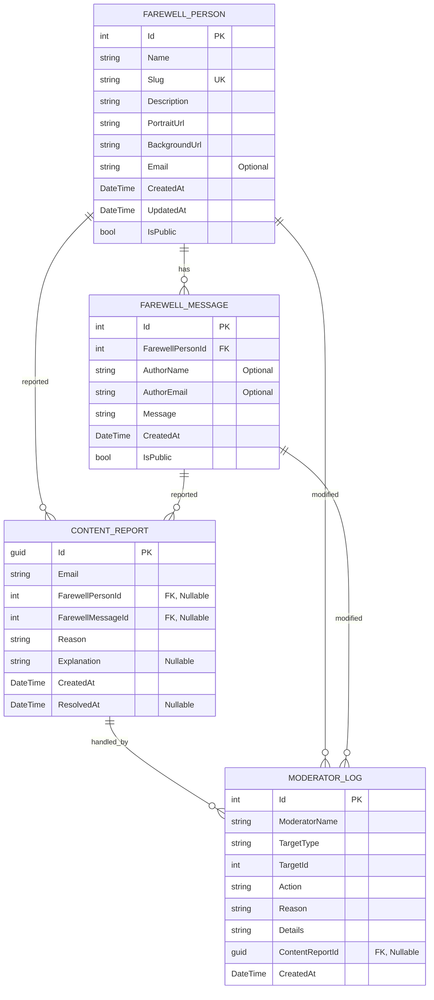

# Farewell My Beloved

A compassionate web platform where people can create memorial pages for their loved ones and share heartfelt farewell messages, with comprehensive admin moderation and content management capabilities.

## 🌟 Overview

Farewell My Beloved provides a digital space for remembrance and tribute. Users can create dedicated pages for individuals who have passed away, and visitors can leave messages of condolence, memories, and farewells. The platform includes robust admin features for content moderation, reporting, and management, while maintaining privacy by allowing message authors to remain anonymous if they choose.

## ✨ Key Features

### Core Functionality
- **Memorial Page Creation**: Anyone can create a dedicated page for a loved one
- **Customizable Pages**: Set background images, upload portraits, and write descriptions
- **Dynamic URLs**: Each memorial page gets a unique URL (e.g., `example.com/DonaldTrump`)
- **Message System**: Visitors can leave heartfelt farewell messages
- **Optional Identity**: Message authors can choose to remain anonymous
- **Responsive Design**: Works beautifully on all devices

### Admin & Moderation Features
- **Admin Dashboard**: Comprehensive analytics and monitoring tools
- **Content Moderation**: Edit and delete inappropriate content
- **User Reporting**: Content reporting system with multiple reason categories
- **Activity Logging**: Complete audit trail of all admin actions
- **Role-Based Access**: GitHub OAuth-based authentication with admin privileges
- **Content Management**: Bulk operations on farewell people and messages

### User Experience
- **Simple Interface**: Easy-to-use forms for creating pages and posting messages
- **File Upload Support**: Upload portraits and background images for personalization
- **Auto-Approval**: Messages are published immediately without hassle
- **Search Functionality**: Find memorial pages by name or description

## 🏗️ Architecture

### Technology Stack
- **Backend**: ASP.NET Core 9.0 MVC
- **Database**: Entity Framework Core with SQL Server
- **Frontend**: Bootstrap 5, jQuery, Font Awesome Icon
- **Image Hosting**: AWS S3-compatible storage
- **Authentication**: GitHub OAuth with cookie-based sessions
- **Cloud Services**: Amazon S3 SDK for file management

### Database Schema


### System Components
- **Controllers**: Handle HTTP requests and business logic
- **Models**: Define data structures and relationships
- **Views**: Render user interfaces using Razor syntax
- **Services**: Manage business logic and data operations
- **Middleware**: Handle routing and request processing

## 🚀 Getting Started

### Prerequisites
- .NET 9.0 SDK
- SQL Server (or compatible database)
- Visual Studio 2022 or VS Code
- GitHub account for admin authentication
- S3 Compatible account for image hosting

### Installation
1. Clone the repository
2. Restore dependencies: `dotnet restore`
3. Update database connection in `appsettings.json`
4. Apply migrations: `dotnet ef database update`
5. Run the application: `dotnet run`

### Configuration
Configure your database connection, S3 storage, GitHub authentication, and admin settings in `appsettings.json`:
```json
{
  "ConnectionStrings": {
    "DefaultConnection": "Server=(localdb)\\mssqllocaldb;Database=FarewellMyBeloved;Trusted_Connection=True;MultipleActiveResultSets=true"
  },
  "S3": {
    "Bucket": "farewell-my-beloved-images",
    "AccessKey": "YOUR_S3_ACCESS_KEY",
    "SecretKey": "YOUR_S3_SECRET_KEY",
    "Endpoint": "https://s3.filebase.com"
  },
  "Authentication": {
    "GitHub": {
      "ClientId": "your-github-client-id",
      "ClientSecret": "your-github-client-secret"
    }
  },
  "Admin": {
    "Emails": [
      "admin@example.com",
      "admin.2@example.com"
    ],
    "ReasonStrings": [
      "Spam",
      "Abuse",
      "Inappropriate Content",
      "Other"
    ]
  }
}
```

### Setup Instructions
1. **GitHub OAuth Setup**:
   - Visit [GitHub Developer Settings](https://github.com/settings/developers)
   - Create a new OAuth App
   - Set Authorization callback URL to `http://localhost:5000/signin-github` (or your production URL)
   - Add Client ID and Secret to `appsettings.json`

2. **S3 Storage Setup**:
   - Use any compatible S3 service
   - Create a bucket for storing images
   - Generate access keys
   - Configure bucket for public read access
   - Update S3 settings in `appsettings.json`

3. **Admin Configuration**:
   - Add GitHub email addresses of admin users to the `Admin:Emails` array
   - Configure reason strings for content reporting

## 📁 Project Structure

```
FarewellMyBeloved/
├── Controllers/           # MVC Controllers
│   ├── HomeController.cs
│   ├── FarewellPersonController.cs
│   ├── FarewellMessageController.cs
│   ├── AdminController.cs     # Admin dashboard and moderation
│   └── ReportController.cs    # Content reporting system
├── Models/               # Data models and view models
│   ├── ApplicationDbContext.cs
│   ├── FarewellPerson.cs
│   ├── FarewellMessage.cs
│   ├── ContentReport.cs       # User content reporting
│   └── ModeratorLog.cs        # Admin action logging
├── Views/                # Razor views
│   ├── Home/            # Home page views
│   ├── FarewellPerson/  # Memorial page views
│   ├── Admin/           # Admin dashboard and management
│   ├── Report/          # Content reporting views
│   └── Shared/          # Shared layout components
├── Services/            # Business logic services
│   ├── IS3Service.cs    # S3 storage interface
│   └── S3Service.cs     # S3 storage implementation
├── ViewModels/          # View models for various pages
├── wwwroot/             # Static files
│   ├── css/            # Stylesheets
│   ├── js/             # JavaScript files
│   └── images/         # Static images
├── Migrations/          # Entity Framework migrations
└── appsettings.json    # Configuration including S3, auth, and admin settings
```

## 🎯 Usage Guide

### Creating a Memorial Page
1. Navigate to the home page
2. Click "Create Memorial Page"
3. Fill in the person's name and description
4. Upload a portrait image (or use an existing image url)
5. Upload a background image (or use an existing image url)
6. Submit the form
7. Share the unique URL with others

### Leaving a Message
1. Visit a memorial page URL
2. Scroll to the message section
3. Optionally enter your name and email
4. Write your heartfelt message
5. Submit the message
6. Your message will appear immediately

### Customizing Pages
- **Portraits**: Upload clear, respectful images of the person
- **Backgrounds**: Choose images that complement the memorial theme
- **Descriptions**: Write meaningful biographical information
- **Privacy**: All pages are public by default

### Admin Features
- **Dashboard**: View analytics and statistics for all content
- **Content Management**: Edit or delete farewell people and messages
- **Moderation**: Handle user reports with detailed action logging
- **Audit Trail**: Complete history of all admin actions and decisions
- **Bulk Operations**: Manage multiple items efficiently

## 🔒 Privacy & Security

### Message Privacy
- **Anonymous Posting**: All message fields (name, email) are optional
- **No Personal Data Collection**: We don't require personal information for message posting
- **Public Messages**: All messages are displayed publicly on memorial pages

### Admin Security
- **GitHub OAuth**: Secure authentication using GitHub's OAuth system
- **Role-Based Access**: Only authorized GitHub users can access admin features
- **Email Whitelisting**: Admin access restricted to specific GitHub accounts
- **Session Management**: Secure cookie-based authentication with proper logout

### Data Protection
- **Input Validation**: All user inputs are validated and sanitized
- **File Upload Security**: Restricted file types and size limits for S3 uploads
- **XSS Protection**: Built-in security measures prevent cross-site scripting
- **S3 Security**: Secure file storage with proper access controls

## 🛠️ Development

### Running Tests
```bash
dotnet test
```

### Code Quality
- Follow C# coding standards
- Use meaningful variable and method names
- Implement proper error handling
- Write clean, maintainable code

### Adding New Features
1. Create appropriate models
2. Implement controller actions
3. Design views with Bootstrap
4. Add necessary services
5. Test thoroughly

## 📝 Future Enhancements

### Current Features (Implemented)
- ✅ Admin dashboard with comprehensive analytics
- ✅ Content moderation and reporting system
- ✅ GitHub OAuth authentication
- ✅ AWS S3-compatible image hosting
- ✅ Complete audit logging of admin actions
- ✅ Role-based access control
- ✅ Content management with bulk operations

### Planned Features
- [ ] Advanced search and filtering capabilities
- [ ] Social media sharing integration
- [ ] Mobile app development
- [ ] Multi-language support
- [ ] Theme customization options
- [ ] Enhanced analytics dashboard

### Cancelled Features
- ❎ Email notifications for new messages and reports

### Technical Improvements
- [ ] Caching for better performance
- [ ] API development for third-party integration
- [ ] Enhanced analytics and statistics tracking
- [ ] SEO optimization
- [ ] Rate limiting and DDoS protection

## 🤝 Contributing

We welcome contributions to make Farewell My Beloved a better platform for everyone. Please follow these guidelines:

### Development Guidelines
1. Fork the repository
2. Create a feature branch (`git checkout -b feature/amazing-feature`)
3. Make your changes following C# coding standards
4. Add tests if applicable
5. Ensure all existing tests pass
6. Submit a pull request with a clear description of changes

### Code Standards
- Follow C# coding conventions and best practices
- Use meaningful variable and method names
- Implement proper error handling and logging
- Write clean, maintainable code with proper documentation
- Ensure security best practices are followed

### Testing
- Run the test suite before submitting changes
- Add unit tests for new functionality
- Test admin features thoroughly
- Verify all authentication and authorization flows

## 📄 License

This project is licensed under the GPL-3.0 License - see the LICENSE file for details.

## 🙏 Acknowledgments

This platform is created with the hope of providing a meaningful space for remembrance and healing. We honor the memories of those who have passed away and support those who grieve.

---

*For support, questions, or suggestions, please open an issue in the repository.*