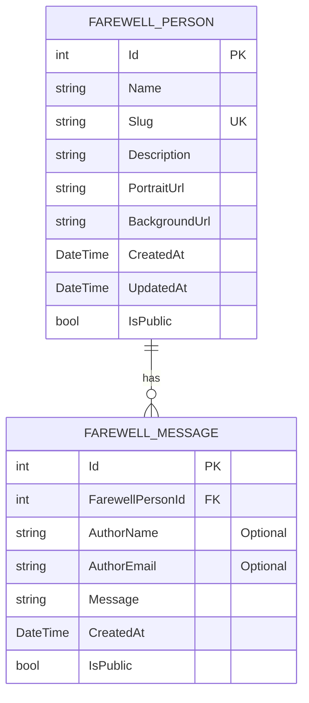

# Farewell My Beloved

A compassionate web platform where people can create memorial pages for their loved ones and share heartfelt farewell messages.

## 🌟 Overview

Farewell My Beloved provides a digital space for remembrance and tribute. Users can create dedicated pages for individuals who have passed away, and visitors can leave messages of condolence, memories, and farewells. The platform emphasizes privacy, allowing message authors to remain anonymous if they choose.

## ✨ Key Features

### Core Functionality
- **Memorial Page Creation**: Anyone can create a dedicated page for a loved one
- **Customizable Pages**: Set background images, upload portraits, and write descriptions
- **Dynamic URLs**: Each memorial page gets a unique URL (e.g., `example.com/DonaldTrump`)
- **Message System**: Visitors can leave heartfelt farewell messages
- **Optional Identity**: Message authors can choose to remain anonymous
- **Responsive Design**: Works beautifully on all devices

### User Experience
- **Simple Interface**: Easy-to-use forms for creating pages and posting messages
- **File Upload Support**: Upload portraits and background images for personalization
- **Message Pagination**: Navigate through multiple messages easily
- **Auto-Approval**: Messages are published immediately without moderation
- **Search Functionality**: Find memorial pages by name or browse all available pages

## 🏗️ Architecture

### Technology Stack
- **Backend**: ASP.NET Core 9.0 MVC
- **Database**: Entity Framework Core with SQL Server
- **Frontend**: Bootstrap 5, jQuery
- **Image Hosting**: External service (imgBB API)

### Database Schema


### System Components
- **Controllers**: Handle HTTP requests and business logic
- **Models**: Define data structures and relationships
- **Views**: Render user interfaces using Razor syntax
- **Services**: Manage business logic and data operations
- **Middleware**: Handle routing and request processing

## 🚀 Getting Started

### Prerequisites
- .NET 9.0 SDK
- SQL Server (or compatible database)
- Visual Studio 2022 or VS Code

### Installation
1. Clone the repository
2. Restore dependencies: `dotnet restore`
3. Update database connection in `appsettings.json`
4. Apply migrations: `dotnet ef database update`
5. Run the application: `dotnet run`

### Configuration
Configure your database connection and imgBB API key in `appsettings.json`:
```json
{
  "ConnectionStrings": {
    "DefaultConnection": "Server=.;Database=FarewellMyBeloved;Trusted_Connection=True;TrustServerCertificate=True"
  },
  "ImgBB": {
    "ApiKey": "your_imgbb_api_key_here"
  }
}
```

### Getting imgBB API Key
1. Visit [imgbb.com](https://imgbb.com)
2. Sign up for a free account
3. Go to your dashboard and find your API key
4. Add the API key to your `appsettings.json`

## 📁 Project Structure

```
FarewellMyBeloved/
├── Controllers/           # MVC Controllers
├── Models/               # Data models and view models
├── Views/                # Razor views
│   ├── Home/            # Home page views
│   ├── FarewellPerson/  # Memorial page views
│   └── Shared/          # Shared layout components
├── wwwroot/             # Static files
│   ├── css/            # Stylesheets
│   ├── js/             # JavaScript files
│   └── images/         # Static images
├── Data/                # Database context
├── Services/            # Business logic services
├── Interfaces/          # Service interfaces
└── appsettings.json    # Configuration including imgBB API key
```

## 🎯 Usage Guide

### Creating a Memorial Page
1. Navigate to the home page
2. Click "Create Memorial Page"
3. Fill in the person's name and description
4. Upload a portrait image (optional)
5. Upload a background image (optional)
6. Submit the form
7. Share the unique URL with others

### Leaving a Message
1. Visit a memorial page URL
2. Scroll to the message section
3. Optionally enter your name and email
4. Write your heartfelt message
5. Submit the message
6. Your message will appear immediately

### Customizing Pages
- **Portraits**: Upload clear, respectful images of the person (hosted externally via imgBB)
- **Backgrounds**: Choose images that complement the memorial theme (hosted externally via imgBB)
- **Descriptions**: Write meaningful biographical information
- **Privacy**: All pages are public by default
- **Image Hosting**: Images are automatically uploaded to imgBB and stored externally

## 🔒 Privacy & Security

### Message Privacy
- **Anonymous Posting**: All message fields (name, email) are optional
- **No Personal Data Collection**: We don't require personal information for message posting
- **Public Messages**: All messages are displayed publicly on memorial pages

### Data Protection
- **Input Validation**: All user inputs are validated and sanitized
- **File Upload Security**: Restricted file types and size limits
- **XSS Protection**: Built-in security measures prevent cross-site scripting

## 🛠️ Development

### Running Tests
```bash
dotnet test
```

### Code Quality
- Follow C# coding standards
- Use meaningful variable and method names
- Implement proper error handling
- Write clean, maintainable code

### Adding New Features
1. Create appropriate models
2. Implement controller actions
3. Design views with Bootstrap
4. Add necessary services
5. Test thoroughly

## 📝 Future Enhancements

### Planned Features
- [ ] User authentication for page management
- [ ] Admin panel for content moderation
- [ ] Email notifications for new messages
- [ ] Advanced search and filtering
- [ ] Social media sharing integration
- [ ] Mobile app development
- [ ] Multi-language support
- [ ] Theme customization options

### Technical Improvements
- [ ] Cloud storage integration (Azure Blob/AWS S3)
- [ ] Caching for better performance
- [ ] API development for third-party integration
- [ ] Analytics and statistics tracking
- [ ] SEO optimization

## 🤝 Contributing

We welcome contributions to make Farewell My Beloved a better platform for everyone. Please follow these guidelines:

1. Fork the repository
2. Create a feature branch
3. Make your changes
4. Add tests if applicable
5. Submit a pull request

## 📄 License

This project is licensed under the MIT License - see the LICENSE file for details.

## 🙏 Acknowledgments

This platform is created with the hope of providing a meaningful space for remembrance and healing. We honor the memories of those who have passed away and support those who grieve.

---

*For support, questions, or suggestions, please open an issue in the repository.*