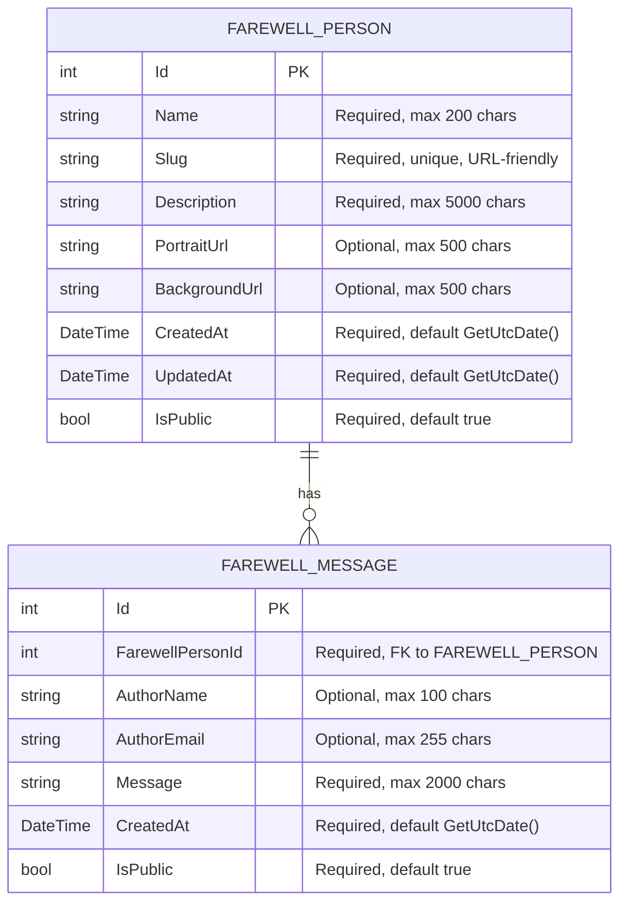

# Software Specification - Farewell My Beloved

## 1. Introduction

### 1.1 Purpose
This document provides a comprehensive technical specification for the Farewell My Beloved web application. The application serves as a digital memorial platform where users can create dedicated pages for deceased individuals and allow visitors to leave farewell messages.

### 1.2 Scope
The initial implementation focuses on core functionality without authentication, allowing:
- Creation of memorial pages with customizable content
- Dynamic routing for individual memorial pages
- Message posting with optional author identification
- File upload support for images
- Responsive web interface

### 1.3 Definitions
- **Memorial Page**: A dedicated web page for remembering a deceased person
- **Slug**: URL-friendly identifier for memorial pages (e.g., "donald-trump")
- **Message**: A farewell message left by a visitor
- **Author**: Optional identifier for message posters (name/email)

## 2. System Architecture

### 2.1 High-Level Architecture
```
┌─────────────────┐    ┌─────────────────┐    ┌─────────────────┐
│   Presentation  │    │    Business     │    │      Data       │
│     Layer       │◄──►│     Logic       │◄──►│     Layer       │
│                 │    │     Layer       │    │                 │
│ - Controllers   │    │ - Services      │    │ - Entity Models │
│ - Views         │    │ - Validation    │    │ - DbContext     │
│ - ViewModels    │    │ - Business Rules│    │ - Repositories  │
└─────────────────┘    └─────────────────┘    └─────────────────┘
```

### 2.2 Technology Stack
- **Backend Framework**: ASP.NET Core 9.0 MVC
- **Database**: Entity Framework Core with SQL Server
- **Frontend**: Bootstrap 5, jQuery 3.7.0
- **Image Hosting**: External service (imgBB API)
- **Runtime**: .NET 9.0

### 2.3 Design Patterns
- **MVC Pattern**: Separation of concerns between Model, View, and Controller
- **Repository Pattern**: Data access abstraction
- **Service Layer Pattern**: Business logic encapsulation
- **Dependency Injection**: For loose coupling and testability

## 3. Database Design

### 3.1 Entity-Relationship Diagram


### 3.2 Database Schema Details

#### FAREWELL_PERSON Table
| Column | Data Type | Constraints | Description |
|--------|-----------|-------------|-------------|
| Id | int | Primary Key, Identity | Unique identifier |
| Name | nvarchar(200) | Required, MaxLength(200) | Person's full name |
| Slug | nvarchar(200) | Required, MaxLength(200), Unique | URL-friendly identifier |
| Description | nvarchar(5000) | Required, MaxLength(5000) | Biographical information |
| PortraitUrl | nvarchar(500) | Optional, MaxLength(500) | Path to portrait image |
| BackgroundUrl | nvarchar(500) | Optional, MaxLength(500) | Path to background image |
| CreatedAt | datetime2 | Required, Default(GetUtcDate()) | Creation timestamp |
| UpdatedAt | datetime2 | Required, Default(GetUtcDate()) | Last update timestamp |
| IsPublic | bit | Required, Default(1) | Page visibility status |

#### FAREWELL_MESSAGE Table
| Column | Data Type | Constraints | Description |
|--------|-----------|-------------|-------------|
| Id | int | Primary Key, Identity | Unique identifier |
| FarewellPersonId | int | Required, Foreign Key | Reference to memorial page |
| AuthorName | nvarchar(100) | Optional, MaxLength(100) | Message author's name |
| AuthorEmail | nvarchar(255) | Optional, MaxLength(255) | Message author's email |
| Message | nvarchar(2000) | Required, MaxLength(2000) | Message content |
| CreatedAt | datetime2 | Required, Default(GetUtcDate()) | Creation timestamp |
| IsPublic | bit | Required, Default(1) | Message visibility status |

### 3.3 Database Indexes
```sql
-- Primary keys are automatically indexed

-- Performance indexes
CREATE INDEX IX_FarewellPerson_Slug ON FAREWELL_PERSON(Slug);
CREATE INDEX IX_FarewellMessage_FarewellPersonId ON FAREWELL_MESSAGE(FarewellPersonId);
CREATE INDEX IX_FarewellMessage_CreatedAt ON FAREWELL_MESSAGE(CreatedAt DESC);
```

## 4. API Specification

### 4.1 Controllers and Actions

#### HomeController
| Action | HTTP Method | Route | Description |
|--------|-------------|-------|-------------|
| Index | GET | / | Display list of all memorial pages |
| Privacy | GET | /Privacy | Privacy policy page |

#### FarewellPersonController
| Action | HTTP Method | Route | Description |
|--------|-------------|-------|-------------|
| Index | GET | /FarewellPerson | List all memorial pages |
| Create | GET | /FarewellPerson/Create | Show create form |
| Create | POST | /FarewellPerson/Create | Create new memorial page |
| Edit | GET | /FarewellPerson/Edit/{id} | Show edit form |
| Edit | POST | /FarewellPerson/Edit/{id} | Update memorial page |
| Details | GET | /FarewellPerson/Details/{slug} | Display memorial page |
| Delete | GET | /FarewellPerson/Delete/{id} | Show delete confirmation |
| Delete | POST | /FarewellPerson/Delete/{id} | Delete memorial page |

#### FarewellMessageController
| Action | HTTP Method | Route | Description |
|--------|-------------|-------|-------------|
| Create | POST | /FarewellMessage/Create | Create new message |
| GetMessages | GET | /FarewellMessage/GetMessages/{personId} | Get paginated messages |

### 4.2 ViewModels

#### CreateFarewellPersonViewModel
```csharp
public class CreateFarewellPersonViewModel
{
    [Required(ErrorMessage = "Name is required")]
    [StringLength(200, ErrorMessage = "Name cannot exceed 200 characters")]
    public string Name { get; set; } = string.Empty;

    [Required(ErrorMessage = "Description is required")]
    [StringLength(5000, ErrorMessage = "Description cannot exceed 5000 characters")]
    public string Description { get; set; } = string.Empty;

    [StringLength(500, ErrorMessage = "Portrait URL cannot exceed 500 characters")]
    public string? PortraitUrl { get; set; }

    [StringLength(500, ErrorMessage = "Background URL cannot exceed 500 characters")]
    public string? BackgroundUrl { get; set; }
}
```

#### CreateFarewellMessageViewModel
```csharp
public class CreateFarewellMessageViewModel
{
    [Required(ErrorMessage = "Message is required")]
    [StringLength(2000, ErrorMessage = "Message cannot exceed 2000 characters")]
    public string Message { get; set; } = string.Empty;

    [StringLength(100, ErrorMessage = "Name cannot exceed 100 characters")]
    public string? AuthorName { get; set; }

    [EmailAddress(ErrorMessage = "Invalid email address")]
    [StringLength(255, ErrorMessage = "Email cannot exceed 255 characters")]
    public string? AuthorEmail { get; set; }
}
```

## 5. File Upload Specification

### 5.1 Upload Requirements
- **Portrait Images**: Max 5MB, formats: JPG, PNG, GIF
- **Background Images**: Max 10MB, formats: JPG, PNG
- **Storage Location**: `/wwwroot/uploads/{personId}/`
- **File Naming**: `{timestamp}_{original_filename}`

### 5.2 Upload Validation
```csharp
public class FileUploadValidator
{
    public static bool IsValidImage(IFormFile file, out string errorMessage)
    {
        errorMessage = string.Empty;
        
        if (file == null || file.Length == 0)
        {
            errorMessage = "No file selected";
            return false;
        }

        var allowedExtensions = new[] { ".jpg", ".jpeg", ".png", ".gif" };
        var fileExtension = Path.GetExtension(file.FileName).ToLowerInvariant();
        
        if (!allowedExtensions.Contains(fileExtension))
        {
            errorMessage = "Only JPG, PNG, and GIF files are allowed";
            return false;
        }

        if (file.Length > 5 * 1024 * 1024) // 5MB
        {
            errorMessage = "File size cannot exceed 5MB";
            return false;
        }

        return true;
    }
}
```

## 6. Routing Configuration

### 6.1 Default Routes
```csharp
app.MapControllerRoute(
    name: "default",
    pattern: "{controller=Home}/{action=Index}/{id?}");

// Dynamic route for memorial pages
app.MapControllerRoute(
    name: "memorial-page",
    pattern: "{slug}",
    defaults: new { controller = "FarewellPerson", action = "Details" });
```

### 6.2 Route Priority
1. Static routes (Privacy, etc.)
2. Memorial page dynamic route (`/{slug}`)
3. Default MVC route

## 7. Security Considerations

### 7.1 Input Validation
- Server-side validation for all user inputs
- Client-side validation using jQuery validation
- HTML encoding to prevent XSS attacks
- SQL injection prevention through Entity Framework

### 7.2 File Upload Security
- File type validation
- File size limits
- Safe file naming
- Path traversal prevention

### 7.3 Data Protection
- Sensitive data encryption (future enhancement)
- Rate limiting for message posting
- Request size limits
- CORS configuration

## 8. Performance Requirements

### 8.1 Response Time Targets
- Page load: < 2 seconds
- Database query: < 500ms
- File upload: < 10 seconds (for 5MB files)
- Message submission: < 1 second

### 8.2 Scalability Requirements
- Support 1000+ concurrent users
- Handle 10,000+ memorial pages
- Process 100,000+ messages
- Efficient database indexing

### 8.3 Caching Strategy
- Static file caching
- Database query caching (future enhancement)
- View model caching (future enhancement)

## 9. Error Handling

### 9.1 Error Types
- **Validation Errors**: Form field validation
- **File Upload Errors**: Invalid files, size limits
- **Database Errors**: Connection issues, constraint violations
- **Routing Errors**: 404 for non-existent pages
- **General Errors**: 500 for unexpected issues

### 9.2 Error Response Format
```csharp
public class ErrorResponse
{
    public string Message { get; set; } = string.Empty;
    public string? Details { get; set; }
    public DateTime Timestamp { get; set; }
    public string? RequestId { get; set; }
}
```

## 10. Testing Requirements

### 10.1 Unit Testing
- Controller action testing
- Service layer testing
- Model validation testing
- File upload validation testing

### 10.2 Integration Testing
- Database operations testing
- File upload functionality testing
- API endpoint testing
- Routing testing

### 10.3 End-to-End Testing
- User journey testing
- Browser compatibility testing
- Responsive design testing
- Performance testing

## 11. Deployment Requirements

### 11.1 Environment Setup
- Development: Local IIS Express
- Staging: Cloud-based staging environment
- Production: Cloud-based production environment

### 11.2 Configuration Management
- Environment-specific settings
- Database connection strings
- imgBB API configuration
- Logging configuration

### 11.3 Monitoring and Logging
- Application logging
- Error tracking
- Performance monitoring
- User activity logging (anonymous)
- imgBB API usage tracking

## 12. Future Enhancements

### 12.1 Phase 1 (Current)
- Core memorial page functionality
- Message system with optional author info
- File upload support
- Responsive design

### 12.2 Phase 2 (Planned)
- User authentication
- Admin panel
- Email notifications
- Advanced search

### 12.3 Phase 3 (Future)
- Enhanced image hosting features
- Mobile application
- Analytics dashboard
- Social media integration
- Multiple image hosting provider support

## 13. Compliance and Legal

### 13.1 Data Privacy
- GDPR compliance considerations
- Data retention policies
- User consent for data collection
- Anonymous data handling

### 13.2 Accessibility
- WCAG 2.1 AA compliance
- Screen reader compatibility
- Keyboard navigation support
- Color contrast requirements

---

*This specification document will be updated as the project evolves and new requirements are identified.*